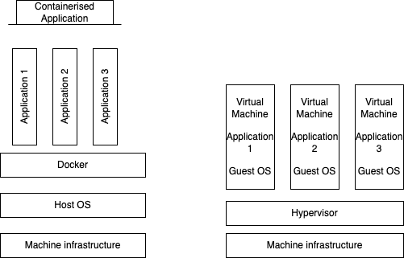

# Containers versus Virtual Machines

Both containers and Virtual Machines represent solutions to the problem of making an application machine agnostic

Virtual Machines operate by simulating hardware and software and therefore allowing multiple applications to run a single server

the architecture resembles: a hardware/server layer followed by a hypervisor - this allows multiple virtual machines to be able to exist concurrently.

A *hypervisor* allocates and controls the sharing of a machine's hardware

Virtual machines provide a greater degree of application isolation compared to containers as containers share the host system's Operating system
where as Virtual Machines virutalise the OS and therefore offer greater process isolation as opposed to Containers which share the host system's OS

traditionally a business infrastructure resembles applications that are running on servers - one application per server 

this results in a wasting of resources however, as servers are capable of more than is being asked of them when they're running a single application and therefore buying a new server is wasteful if it is only going to be used to run a single application

thus virtualisation exists to simulate hardware and software thereby allowing multiple applications to run on a single server

now one server may run for example three virtual machines that each contain a particular operating system and all the relevant applications

## Virtual Machines versus Containers summary    

| **Aspect** | **Container** | **Virtual Machine** |
|:-------------|--------------:|--------------:|
| *Resource Efficiency*       | Lightweight solution with less overhead         | Require more resources than containers (full OS per VM to grant complete isolation from host machine)      | 
| *Start up time*       | fast (order of seconds)         | slow (minutes)         |
| *Aoolication Isolation*        | Shares host OS kernel (i.e lower degree of isolation)              | separate kernel/separate OS (i.e higher degree of isolation)        |
| *OS flexibility*       | Limited to the same OS family as the host         | Can run different operating systems i.e mac os machine can run a vm that operates linux       |
| Security and management       | potentially less secure due to kernel sharing i.e each container has access to the host kernel therefore orchestration tools are needed for large setups        | stronger isolation due to separate OS for each VM which are managed by a hypervisor layer       |

