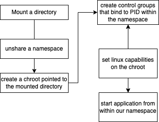

# Docker Technology

Docker is a Containerisation tool

Docker summarised 

- - - 
When we say an application has been *Dockerized* it has been containerized 

the primary challenge that Docker technology seeks to answer is allowing code/applications to run successfully or as _intended_ across multiple machines i.e in different _environments_

the reason this presents as a challenge is because applications will depend on various things such as 

* versions of software libraries 
* operating system it will be run by 
* hardware dependencies 

this can be problematic as not all of these factors may remain consistent with application deployment 

# Mechanics of Docker

---

> docker takes an innovative approach by establishing a new paradigm of creating and deploying applications the _containerization paradigm_ wherein applications and their dependencies are coupled in _container_ structures which can thereafter be transported and deployed in different environments without having to worry about the availability of the application's dependencies as they're available within the container 

> in effect allowing applications to run anywhere much easier

# Docker terminology

---

term
: definition

### _Docker Image_
: is a lightweight, standalone, and executable package that includes everything needed to run a piece of software, including the code, runtime, libraries, environment variables, and configuration files. Docker images serve as the blueprint for creating Docker containers.

### _Dockerfile_
: A Dockerfile is a text file that contains a set of instructions for Docker to automate the process of building a Docker image. It describes the steps needed to create the image, such as specifying the base image, copying application files, installing dependencies, and configuring the environment in which the application will run.
 
### _Docker Container_
: is a lightweight, standalone, and executable unit of software that packages up code and all its dependencies, so the application runs quickly and reliably from one computing environment to another. Containers are isolated environments that run on a shared operating system, providing a standardized way to run applications consistently across different environments (e.g., development, testing, and production).

### _Docker Dameon_
: The Docker daemon (dockerd) is the background service that performs all of Docker's core functionalities, including managing containers, images, volumes, and networks. It listens for Docker API requests (from the CLI or remote API) and processes them, allowing users to interact with Docker through the Docker client. The daemon is crucial for orchestrating and managing Dockerized applications.

### _Docker Client_
: The Docker client is the command-line tool that users interact with to manage Docker containers, images, volumes, and networks. It sends API requests to the Docker daemon, which performs the actual tasks of building images, running containers, and handling resources. The Docker client makes it easy to interact with Docker through a series of simple, user-friendly commands.

### _Docker Registries_
: A Docker registry is a service for storing and distributing Docker images. Registries can be public (like Docker Hub) or private (like AWS ECR or self-hosted). Docker registries allow developers to easily push images for sharing and deployment and pull them for use in containers. This system supports image versioning, secure access, and integration into development workflows, making it a critical part of Docker-based application development and deployment.

### container runtimes versus container engines
|:-------------|--------------:|
|**can**|**cannot**|
|create namespaces| |build images|
|create and associate cgroups to namespaces (container)| |pull images|
|map filesystems to containers|

first table | second table | third table | fourth table 
    --------|--------|-------|----------
 more content table 1 | content table 2 | content table 3 | contant table 4
 more content table 1 | more content table 2 | content table 3 | content table 4
 more content table 1 | more content table 2 | content table 3 | content table 4

container runtimes reduce the number of steps required to create, manage and delete a container reducing having to pe

### Docker architecure

---
>  

docker containers are composed of _namespaces_ and _control groups_

namespaces define what resources a container can access on it's host and control groups define how much of these resources containers can consume - for example a namespace may articulate that a container can access the hardrive for a particular time duration 

but how does this actually happen? It is orchestrated through a container runtime 

mount a directory for the containers file system - this directory should contain all the files and directories required by your to-be containerised app to run 
> mount grep | --color container/dev/disk/by-label/data-volume on /tmp/container type ext3 (rw,relatune)

there are two standard types of container runtimes in use today: 

- OCI runtimes 
    - open container iniative
    - aims to standardize container technology, like container images and runtimes
    - the OCI standard for container runtimes is called the _runtime specification_ and it outlines what a container  is and how it should be managed i.e it is the runtime spec
    - the run time spec articulates the things that the container runtime should do like for example creating containers and starting them - but importantly - not **how** this is done
    - the runtime spec is open source and actively maintained 
    - specs that conform to the _oci_ spec include **runc** (docker's original runtime spec)
    - **crun** on the other hand is the Red Hat default container runtime and is written in c for performance and is maintained by podman - an alternative to Docker as a result of this fact - it is significantly smaller and faster than Docker  
    - **youki** is another oci compliant runtime written in rust
    - although the runtime spec does not specify how to start and stop containers it can still be used to start and stop virtual machines (sandboxed container runtimes)
    - we won't elaborate on some other concepts like sandboxed OCI runtimes like **gVisor** and **Nable Containers** for now other than only mentioning that they use unikernels to restrict what containers can and cannot do and **kata containers** is a container runtime used to create containers inside of virtual machines 
- CRI runtimes 

## summary OCI and CRI runtimes

* there are two cri compatible runtimes in use today: **containerd** that uses **runc** to create **OCI** containers
* **CRI-O** which is a lightweight CRI runtime optimised for *kubernetes* and is maintained by redhat intel and others 

**OCI Runtimes**

OCI (Open Container Initiative): This is a working group that sets standards for container formats and runtimes. The goal is to ensure compatibility and interoperability across different container technologies.

Runtime Specification (Runtime Spec): This standard outlines what a container runtime should do, like creating and stopping containers, but it doesn't dictate how to do it. This allows for flexibility in implementation.

Popular OCI Runtimes
runc: Docker's original runtime, widely used and integrates with many other runtimes.
crun: Used by Podman, it's faster and smaller than runc, written in C.
youki: A newer runtime written in Rust, focusing on performance and security.

**Sandboxed container runtimes**

Sandboxed Container Runtimes
These runtimes offer additional isolation by running containers in a more secure environment, often using virtual machines.
gVisor and Nabla: Create containers against lightweight unikernels for enhanced security.
Kata Containers: Runs containers inside virtual machines, offering the security of VMs with the benefits of containers.

**CRI Runtimes**

CRI Runtimes
CRI (Container Runtime Interface): Created by Kubernetes to standardize how container runtimes interact with Kubernetes, ensuring flexibility and avoiding dependency on a single runtime.
Popular CRI Runtimes:
containerd: Uses runc by default and supports shims for other runtimes like gVisor or Kata. It's the runtime Docker uses today.
CRI-O: Provides just enough functionality to run OCI containers within Kubernetes, maintained by Red Hat and other large companies.

> Key Differences
OCI Runtimes: Focus on standardizing container operations across different platforms.
CRI Runtimes: Focus on integrating seamlessly with Kubernetes, providing flexibility in runtime choice.

## interaction sequence between Docker components 

## docker as a container runtime

Docker containers are composed of control groups and namespaces 

namespaces define which resources containers can access on their host and control groups define how much of these resouces the container may access

namespaces
Docker is a popular container runtime that simplifies this process. Instead of doing everything step-by-step, you can just use a simple command, and Docker takes care of the rest

## the process for this is depicted below

## the docker engine

container engines work in unison with container runtimes

they can be thought of as tools that assist with managing containers 

essentially, the **Docker Engine** assists with creating, managing and running containers effectively
making Docker a powerful tool for building and testing applications for the degree of isolation it offers

the docker engine comes with 
    - a REST-based API for managing containers 
    - a DSL for creating container images called **Dockerfile**
    - uses *containerd* as its runtime by default

>note: podman is a redhat product that is practically equivalent to Docker in almost every use case
an important difference between *docker* and *podman* is that Podman uses *builda* to build container images
also podman uses crun as its container run time unlike containerd which docker uses

## docker configuration ##
lives in /var/lib/docker directory i.e containers, volumes and metadata all live in this directory
>/var/lib/docker/overlay directory stores container volumes 
the docker engine exposes an api for interacting with the other components like the container's runtime: that is to say the pipe between the docker client and the docker engine is called a *socket*; /var/run/docker.sock

## Docker Operations

