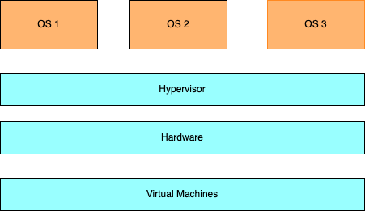

### Virtual Machines

Traditionally the OS (operating system) will control how a computer uses hardware resources 

say you wanted to use a new OS for example Linux

for this you would require a new machines with new hardware to be able to run your Linux Operating System

with Virtualisation - we're able to bypass this requirement for separate hardware to run a different OS through a _hypervisor_ - this technology allows multiple virtual computers to be hosted on a singular set of physical computing resources

the hypervisor will ask the native operating system for some of its resources i.e virtual ram, virtual cpu and virtual storage - a core concept in virtualisation is that **hardware resources are shared between virtual machines**

remember: the virtual machine is although virtual, still constrained by the resources the physical machine actually has available i.e if your computer has 8 GB of RAM you cannot allocate 16GB of RAM to your virtual machine 

> for optimal/maxiumum isolation virtual machines are superior to containers but they incur significant performance costs so a decision needs to be made that takes into account performance versus 