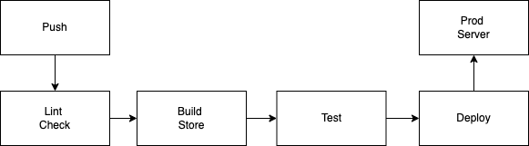

# Continuous Integration

CI describes a software engineering paradigm

the main goal behind CI is to find and resolve problems early rather than problems compounding and creating something inscrutable 

like the traditional git paradigm where developers will work on their code locally and then combine it with the existing code within a project's repository 

# Continuous Delivery

follows on logically from Continuous Integration

here (in this part of the development lifecycle) the integrated code is compiled into artifacts and stored 

to further improve product quality artifacts can be used for additional testing before they're made available for deployment 

# Linting and Unit tests 
through linting we can 
* Enforce coding standards 
* Improve code quality
* detect errors earlier in the design cycle 

# Unit tests 
* typically the first tests that are run for a project
* check code quality at the component level 
* expose problems closer to their source as they're run at a low level 
* fast-running so that they can be run in conjunction with our other build steps without slowing the application down 

# Build and manage artifacts

### Build
 
When a project's code has been transformed from a text representation to an executable/machine-readable format it is call _binary code_ 

the process resembles 

GNU Compiler

# the linker checker
