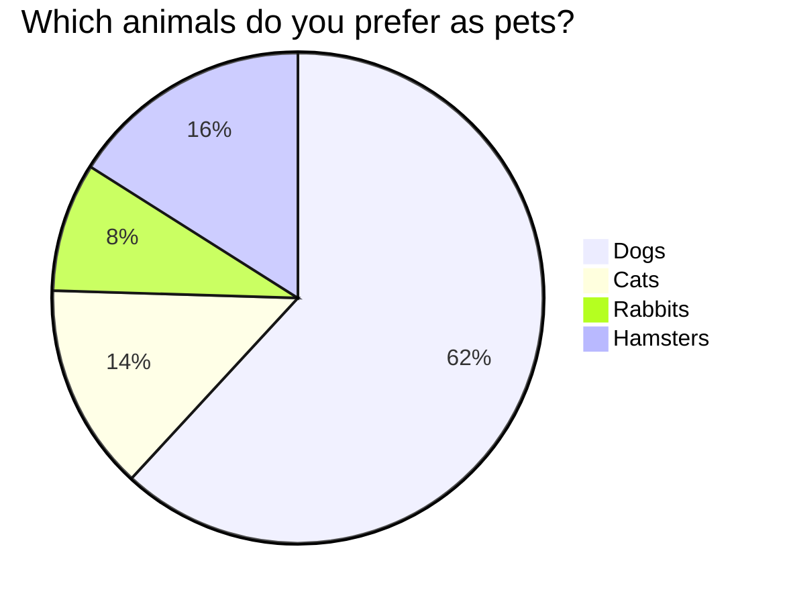

## Common GIT workflows

the purpose of a git workflow is to coordinate the host of actions software writers will undertake including managing code by resolving conflicts and ensuring a continuity to the software application being generated

| _workflow_ | _best used for_ | _key distinguishing feature_|
|--------|--------|-------|
|centralized workflow|simple projects|single branch/linear history|
|feature branch workflow|teams working on multiple feature|separate branches for features, pull requests, code reviews| 
|gitflow|large teams/projects with structured releases|separate branches for features, releases, hotfixes|
|forking workflow|open-source or external contributors|forks, pull requests, no direct access to the main repo|
|GitHub flow|Continuous integration and small, frequent releases|short-lived branches, continuous deployment|
|Trunk-Based Development|Continuous Integration and delivery CI/CD|Frequent commits, no long-lived branches, strong CI support|


```mermaid
graph LR
    git init --> world
    (local repo)
    world --> again
    again --> hello
```




