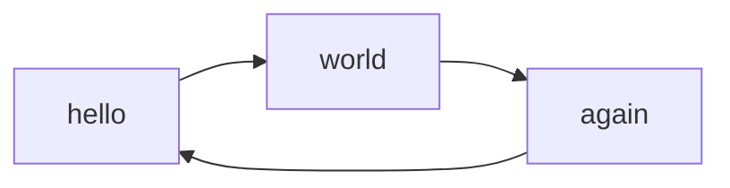
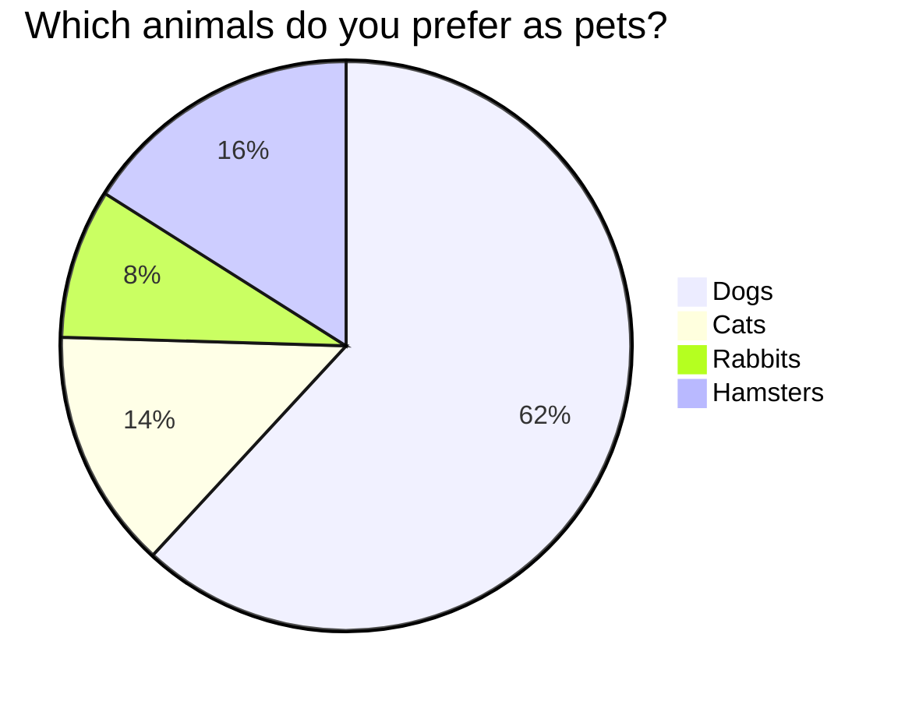

## Common GIT workflows

the purpose of a git workflow is to coordinate the host of actions software writers will undertake including managing code by resolving conflicts and ensuring a continuity to the software application being generated

1. centralized workflow
the centralized workflow lacks advanced features of the distributes workflow which git is intended for being a -distributed version control system-

