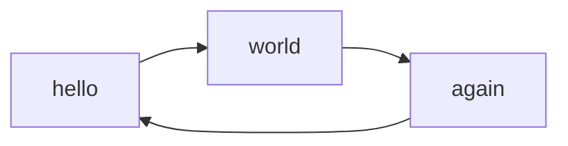
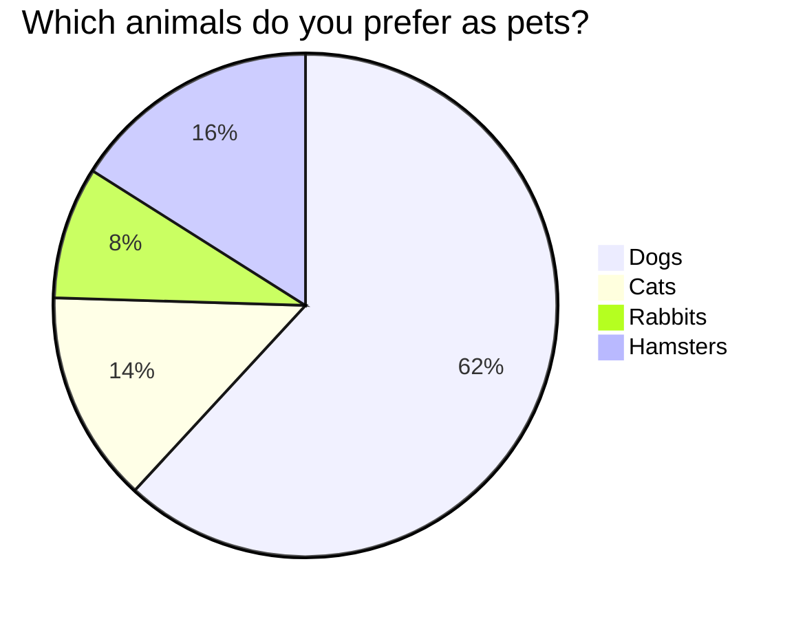

## Common GIT workflows

#

```mermaid
graph LR
    hello --> world
    world --> again
    again --> hello
```

```mermaid
pie title Which animals do you prefer as pets?
    "Dogs" : 386
    "Cats" : 85
    "Rabbits" : 53
    "Hamsters" : 100
```

```mermaid
graph TD;
    A-->B;
    A-->C;
    B-->D;
    C-->D;
```